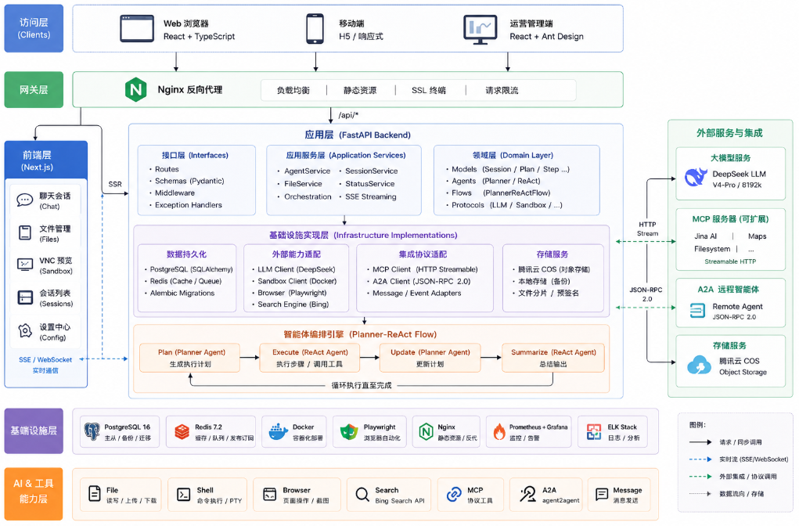

# GoodManus - 通用 AI Agent 系统

GoodManus 是一个通用的 AI Agent 系统，支持完全私有化部署，使用 A2A + MCP 连接 Agent/Tool，同时支持在沙箱中运行各种内置工具和操作。


## 项目结构

```
mooc-manus/
├── api/              # 后端 API 服务（FastAPI）
├── ui/               # 前端服务（Next.js）
├── sandbox/          # 沙箱服务（Ubuntu + Chrome + VNC）
├── nginx/            # Nginx 网关配置
│   ├── nginx.conf
│   └── conf.d/
│       └── default.conf
├── docker-compose.yml
├── deploy.sh         # 一键部署脚本
├── .env              # 环境变量配置
├── .env.example      # 环境变量示例
└── README.md
```

## 快速部署

### 前置要求

- Docker >= 20.10
- Docker Compose >= 2.0
- 至少 4GB 可用内存
- 至少 20GB 可用磁盘空间

### 一键部署

1. **配置环境变量**

   复制并编辑根目录下的 `.env` 文件：

   ```bash
   # 必须修改的配置（腾讯云 COS）
   COS_SECRET_ID=your_cos_secret_id_here
   COS_SECRET_KEY=your_cos_secret_key_here
   COS_BUCKET=your_cos_bucket_here
   COS_REGION=ap-chongqing

   # 可选配置
   NGINX_PORT=8888                    # 对外访问端口
   POSTGRES_PASSWORD=postgres         # 数据库密码
   ```

2. **配置 AI 模型**

   首次部署时，复制示例配置并填入自己的密钥：

   ```bash
   cp api/config.yaml.example api/config.yaml
   ```

   然后修改 `api/config.yaml` 中的 LLM 配置：

   ```yaml
   llm_config:
     base_url: https://api.deepseek.com/
     api_key: your_api_key_here
     model_name: deepseek-reasoner
   ```

   > 同样地，根目录的 `.env` 也通过 `cp .env.example .env` 复制后再编辑。`.env` 与 `api/config.yaml` 都已被 `.gitignore` 排除，请勿提交。

3. **启动所有服务（方式一：使用部署脚本）**

   ```bash
   ./deploy.sh
   ```

   **方式二：手动部署**

   ```bash
   # 构建并启动服务
   docker compose up -d --build

   # 执行数据库迁移（首次部署需要）
   docker compose exec manus-api alembic upgrade head
   ```

4. **访问系统**

   打开浏览器访问 `http://your-server-ip:8888`

### 服务架构

```
                     ┌─────────────┐
      Port 8888      │   Nginx     │
    ─────────────────►  (Gateway)  │
                     └──────┬──────┘
                            │
               ┌────────────┴────────────┐
               │ /                       │ /api
               ▼                         ▼
        ┌─────────────┐          ┌─────────────┐
        │  Next.js UI │          │  FastAPI     │
        │  (Port 3000)│          │  (Port 8000) │
        └─────────────┘          └──────┬──────┘
                                        │
                     ┌──────────────────┼──────────────────┐
                     │                  │                   │
                     ▼                  ▼                   ▼
              ┌───────────┐     ┌───────────┐       ┌───────────┐
              │ PostgreSQL│     │   Redis   │       │  Sandbox  │
              │(Port 5432)│     │(Port 6379)│       │ (VNC/HTTP)│
              └───────────┘     └───────────┘       └───────────┘
```

### 容器列表

| 容器名称 | 服务 | 说明 |
|---------|------|------|
| manus-nginx | Nginx | 反向代理网关，唯一对外暴露端口 |
| manus-ui | Next.js | 前端 UI 服务 |
| manus-api | FastAPI | 后端 API 服务 |
| manus-postgres | PostgreSQL | 数据库 |
| manus-redis | Redis | 缓存 |
| manus-sandbox | Sandbox | 沙箱环境（Chrome + VNC） |

### 网络安全

- 只有 Nginx（端口 8888）对外暴露
- Redis、PostgreSQL、API、UI、Sandbox 仅在容器网络内部可访问
- 所有内部服务通过 Docker 网络 `manus-network` 通信

### 部署脚本

项目提供 `deploy.sh` 脚本简化部署操作：

```bash
# 完整部署（检查环境、构建、启动、迁移）
./deploy.sh

# 停止服务
./deploy.sh --stop

# 重启服务
./deploy.sh --restart

# 查看日志
./deploy.sh --logs

# 执行数据库迁移
./deploy.sh --migrate

# 显示帮助
./deploy.sh --help
```

### 常用命令

```bash
# 启动所有服务（后台运行）
docker compose up -d --build

# 查看所有服务状态
docker compose ps

# 查看服务日志
docker compose logs -f              # 所有服务
docker compose logs -f manus-api    # 仅 API 服务
docker compose logs -f manus-ui     # 仅 UI 服务

# 重启单个服务
docker compose restart manus-api

# 停止所有服务
docker compose down

# 停止并清除数据卷（谨慎操作）
docker compose down -v

# 执行数据库迁移
docker compose exec manus-api alembic upgrade head

# 创建新的迁移
docker compose exec manus-api alembic revision --autogenerate -m "描述"
```

### 启用 HTTPS

1. **准备 SSL 证书**

   将 SSL 证书放入 `nginx/ssl/` 目录：
   - `fullchain.pem`（证书链）
   - `privkey.pem`（私钥）

2. **修改 Nginx 配置**

   编辑 `nginx/conf.d/default.conf`，取消 SSL server 块注释

3. **修改 docker-compose.yml**

   取消 443 端口映射的注释

4. **重启 Nginx**

   ```bash
   docker compose restart manus-nginx
   ```

## 本地开发

各子项目的本地开发说明请参考对应目录下的 README：

- [API 服务](./api/README.md)
- [前端 UI](./ui/README.md)
- [沙箱服务](./sandbox/README.md)

## 故障排查

### 服务无法启动

```bash
# 检查日志
docker compose logs -f [服务名]

# 检查资源使用情况
docker stats
```

### 数据库连接失败

```bash
# 检查 PostgreSQL 状态
docker compose exec manus-postgres pg_isready -U postgres

# 重新执行迁移
docker compose exec manus-api alembic upgrade head
```

### VNC 连接失败

- 确保沙箱服务已启动并正常运行
- 检查 API 服务能否连接到沙箱：`docker compose exec manus-api curl http://manus-sandbox:8080/api/supervisor/status`

## 许可证

MIT License
