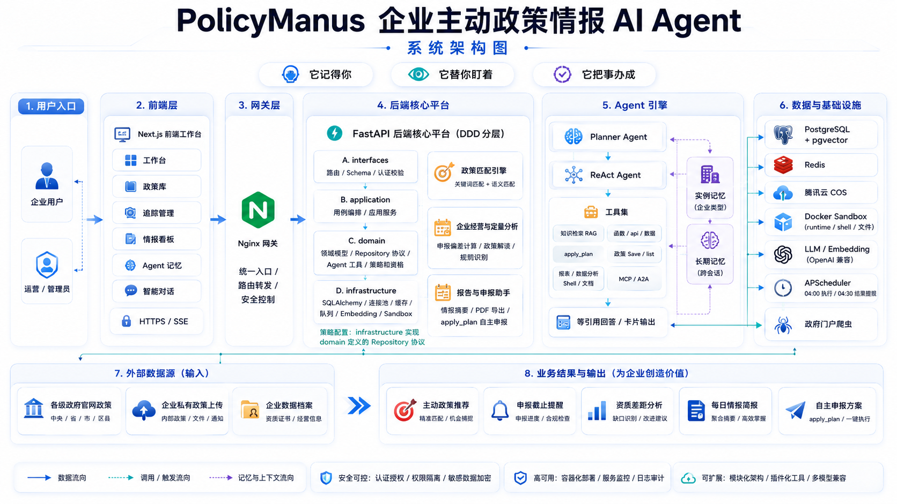
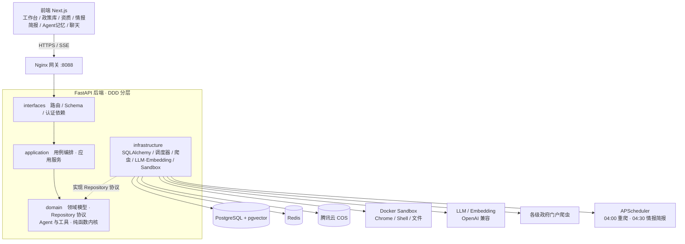
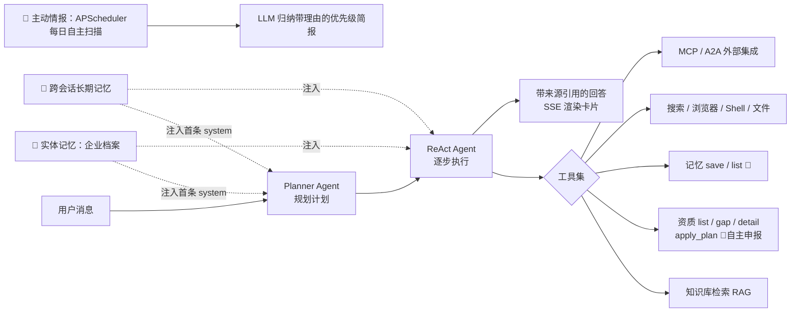

# PolicyManus —— 企业主动政策情报 AI Agent

> 企业填一次档案，Agent 持续替你**主动**匹配政策、归纳机会、提醒申报，
> 并能在对话中**记得你、替你盯着、把事办成**。

🌐 **在线体验：http://118.196.142.222:8088** —— 评委可**直接在首页注册一个组织账号**即可使用（注册即创建专属工作区、无需审批）。

> 📄 比赛材料：[项目说明书 / 技术文档](./docs/competition/项目说明书.md) ·
> [演示视频脚本](./docs/competition/演示视频脚本.md)

---

## ✨ 它能做什么

- **主动政策匹配**：抓取各级政府官网惠企政策，与企业档案双路（关键词 + 语义）匹配，给出推荐理由。
- **申报截止提醒**：LLM 从政策正文抽取申报截止，临期倒计时（≤3 天红 / ≤14 天琥珀）。
- **资质差距分析**：结构化资质目录 × 档案，逐条核验"达标 / 不达标 / 待确认"。
- **主动情报简报**：Agent 自主扫描机会、AI 归纳带理由的优先级简报，每天自动刷新。
- **自主申报助手**：一句话目标（"帮我把高企申报准备好"）→ 一站式申报准备方案。
- **跨会话记忆**：记住你说过的事实与偏好，新会话自动想起。
- **私有政策库 + 报告**：企业上传自有政策做私有检索；一键导出政策匹配简报 PDF。

### 让它成为"真 Agent"的三件套

| 能力 | 一句话 |
|---|---|
| 🧠 两层记忆 | **它记得你**：实体记忆（注入企业档案，不反问）+ 跨会话长期记忆（记住你说过的事，新会话召回） |
| 📡 主动情报 | **它替你盯着**：自主扫描机会、AI 归纳优先级简报，每天 04:30 自动刷新 |
| 🎯 自主申报 | **它把事办成**：一句话目标 → 申报准备方案（条件核验 + 缺口 + 材料 + 时间线） |

> 完整能力与技术细节见 [项目说明书 / 技术文档](./docs/competition/项目说明书.md)。

---

## 🏗️ 系统架构



### 分层架构与核心链路



> **依赖倒置**：`infrastructure` 实现 `domain` 定义的 Repository 协议；匹配/差距分析/记忆渲染/简报归纳等核心逻辑都是 `domain` 层**纯函数**，可离线单测、不碰数据库。

### Agent 引擎与"真 Agent 三件套"



> 🧠 **它记得你**（两层记忆注入）· 📡 **它替你盯着**（定时自主情报简报）· 🎯 **它把事办成**（apply_plan 目标驱动编排）。

**后端分层（DDD）**：`interfaces`（路由/Schema/认证）→ `application`（用例编排）→
`domain`（领域模型 / Repository 协议 / Agent 与工具 / 纯函数内核）← `infrastructure`（DB/Redis/COS/Sandbox/LLM/爬虫/调度器 实现）。

---

## 🧰 技术栈

| 层 | 技术 |
|---|---|
| 前端 | Next.js 16 · React 19 · TypeScript · Tailwind · shadcn/ui · SSE |
| 后端 | FastAPI · Pydantic v2 · SQLAlchemy Async · Alembic · PyJWT · Argon2 |
| 数据 | PostgreSQL + pgvector · Redis |
| AI | OpenAI 兼容 LLM/Embedding · jieba · PyMuPDF · reportlab |
| Agent | Planner+ReAct 双 Agent · 工具集（文件/Shell/浏览器/搜索/知识库/资质/记忆/MCP/A2A） |
| 工具执行 | Docker Sandbox（Ubuntu + Chrome + VNC）· Playwright |
| 部署 | Docker Compose · Nginx |

---

## 🚀 快速启动（本地 Docker）

### 前置要求
- Docker ≥ 20.10、Docker Compose ≥ 2.0
- 至少 4GB 内存、20GB 磁盘

### 步骤

```bash
# 1. 配置环境变量与模型密钥（均已 gitignore，勿提交）
cp .env.example .env                       # 填腾讯云 COS、Embedding key 等
cp api/config.yaml.example api/config.yaml # 填 LLM base_url / api_key / model_name

# 2. 一键启动（构建 + 启动；API 启动会自动执行 alembic 迁移）
docker compose up -d --build

# 3. 访问 http://localhost:8888  （本地默认网关端口，可在 .env 改 NGINX_PORT）
```

> LLM key 决定聊天问答与情报简报的"AI 归纳"是否可用；Embedding key 决定政策向量化与语义匹配。
> 两者缺失时系统仍可运行（聊天不可用、简报走规则兜底），建议配齐以获得完整体验。

### 常用运维

```bash
docker compose ps                                   # 查看状态
docker compose logs -f policy-api                   # 看 API 日志
docker compose exec policy-api alembic upgrade head # 手动迁移
docker compose down                                 # 停止（加 -v 清数据卷，谨慎）
```

---

## 🖥️ 服务器部署（已上线参考）

线上演示环境（118.196.142.222:8088）接服务器本机已有的独立 PostgreSQL，使用部署 override：

```bash
docker compose -f docker-compose.yml -f docker-compose.server.yml up -d --build
```

- `docker-compose.server.yml` 禁用内置 PG（profile `local-database`），`policy-api` 接外部网络用容器名直连本机库。
- `.env` / `api/config.yaml` 单独上送、`chmod 600`，不入仓库；容器 `restart=unless-stopped`，开机自启。

---

## 🔒 安全与隔离

- **唯一对外端口为 Nginx**；DB/Redis/API/UI/Sandbox 仅容器网络内可达。
- **多租户隔离**：JWT 携带 `tenant_id` → 认证依赖 → Repository 按 `tenant_id` 过滤；
  有手动对撞探针 + CI 内 endpoint 隔离测试 + CI 内真库 SQL 层 WHERE 回归三层兜底。
- **密钥管理**：`.env` 与 `api/config.yaml` gitignore，不入库。

---

## ✅ 质量

- **292 个后端离线单元测试**（领域纯函数 / 工具 / 应用服务 / 跨租户隔离）；CI 三项（backend / frontend / 真库 integration）全绿。
- 前端 `tsc` / `eslint` / `next build` 全绿。

### 核心能力效果评测（可复现测试结果）

除"功能正确性"单测外，另建一套**效果评测**衡量核心 AI 能力的"好坏"——带标注数据集 + 量化指标 + 一键复现脚本（`api/tests/eval/`）。全部走**离线确定性**口径：真实 LLM/Embedding 调用只在录制冻结快照时发生，故任何人 clone 后无需密钥/网络即可复现同一组数字。

| 能力 | 数据集 | 评测内核 | 主要指标（当前结果） |
|---|---|---|---|
| ⑥ 资质差距分析 | `qualification_gap.json`（真实资质目录） | `analyze_gap` 纯函数 | 状态准确率 1.0 · 缺字段误报不达标 0 |
| ⑤ 申报截止抽取 | `deadline_extraction.json` | `parse_extraction_result` 纪律层 | 状态/日期准确率 1.0 · 编造率 0 |
| RAG 向量检索 | `rag_retrieval.json` + 真实向量快照 | 余弦排序 | recall@5 1.0 · MRR 1.0 |
| ③ 政策匹配 | `policy_matching.json`（受控语料） | `structured_score` 纯函数 | recall@3 1.0 · 干扰项零误命中 |

```bash
cd api && pip install -r requirements.txt && pip install 'pytest>=9.0.2'
python scripts/run_eval.py     # 一键复现全部指标 + 刷新评测报告
pytest tests/eval -q           # 或以门禁形式运行（指标低于阈值即 fail，CI 同款）
```

完整结果、指标定义与数据集说明见 [`docs/competition/评测报告.md`](./docs/competition/评测报告.md)（由 `run_eval.py` 自动生成）。

---

## 📂 目录结构

```
policy_manus/
├── api/                # 后端（FastAPI，DDD 分层 + Alembic 迁移）
├── ui/                 # 前端（Next.js）
├── sandbox/            # 沙箱（Ubuntu + Chrome + VNC）
├── nginx/              # 网关配置
├── docs/competition/   # 比赛材料：项目说明书 / 演示视频脚本 / 评测报告
├── .agents/            # 协作记忆：STATUS / 架构 / 决策(ADR) / 交接 / 演示动线
└── docker-compose.yml
```

---

## 🩺 故障排查

```bash
# 服务无法启动：看日志 / 看资源
docker compose logs -f <服务名>
docker stats

# 数据库连接失败：检查 PG / 重跑迁移
docker compose exec policy-postgres pg_isready -U postgres -d policy_manus
docker compose exec policy-api alembic upgrade head
```

各子项目本地开发说明见 [`api/README.md`](./api/README.md) · [`ui/README.md`](./ui/README.md) · [`sandbox/README.md`](./sandbox/README.md)。

---

## 📜 许可证

MIT License
